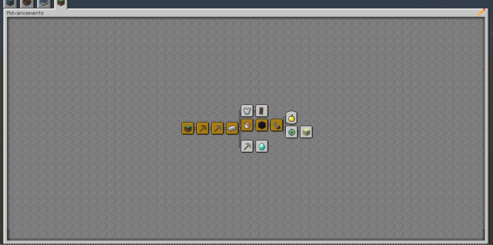
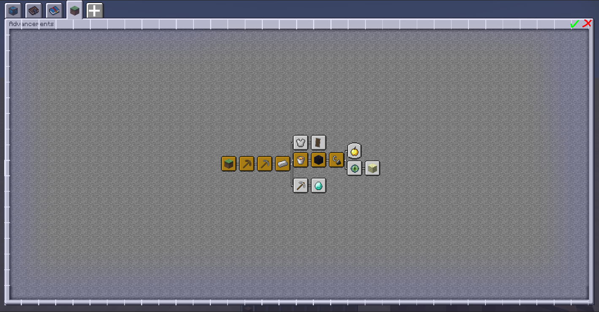

# Advancement Editor

This is the soon to be super detailed wiki for the unpublished Advancement Editor

Here is some really good concept pictures

{.center}
This is how it should look like when opped (little pencil icon at the top right)

{.center}
And this is what i kinda imagine an edit mode to look like

> Advancement Editor | [Modrinth]() | [Curseforge]() | [GitHub](https://github.com/Syrup-Studios/advancement-editor)